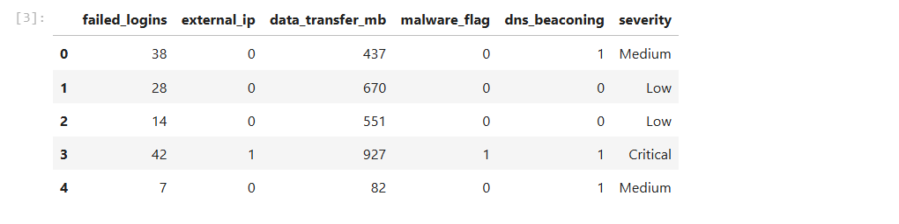
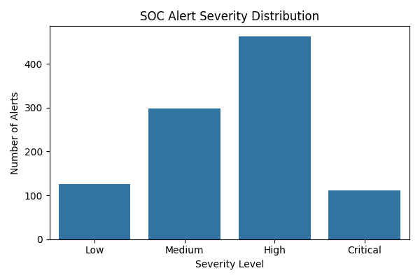
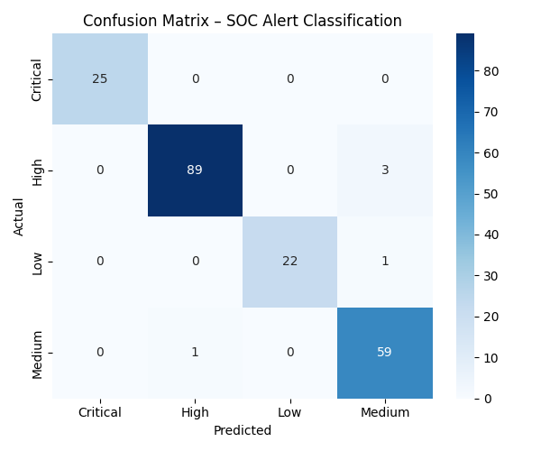
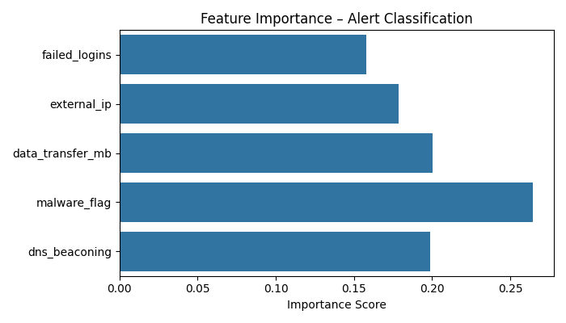
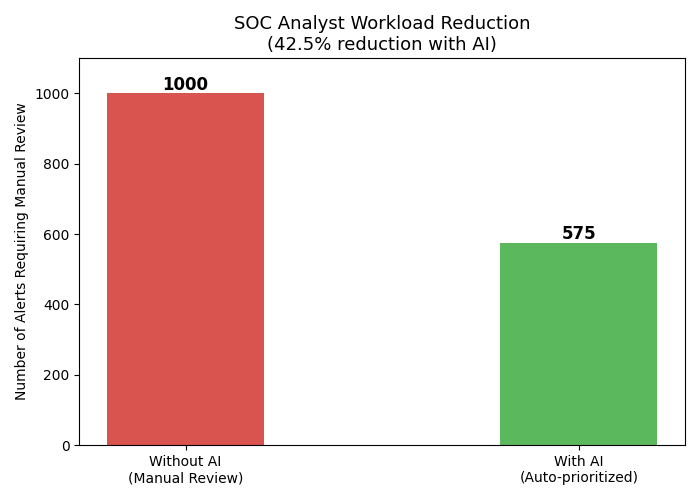

# AI-Driven SOC Alert Prioritization & Response Framework

A machine learning–driven SOC automation framework designed to classify security alerts, prioritize threats based on severity, and recommend remediation actions. The system simulates real-world SOC workflows and demonstrates measurable analyst workload reduction through intelligent alert triage.

---

## Problem Statement

Security Operations Center (SOC) analysts face alert fatigue due to high volumes of security events generated by SIEM platforms. Manual triage is time-consuming, error-prone, and difficult to scale.

This project demonstrates how machine learning can automate alert prioritization and simulate SOAR-style response recommendations, reducing analyst workload while maintaining detection effectiveness.

---

## Solution Overview

A Random Forest classification model trained on simulated SOC alert data that automatically:

- Classifies alerts into **Critical / High / Medium / Low** severity levels  
- Suggests appropriate remediation actions per severity level  
- Measures operational workload reduction impact  

The framework simulates how ML-assisted triage can support real-world SOC environments.

---

## Architecture Workflow

The system follows a structured SOC automation pipeline:

Alert Data → Feature Extraction → ML Classification → Severity Prediction → Remediation Suggestion → Analyst Review Optimization

### System Flow

1. Simulated SOC alerts generated  
2. Feature engineering applied  
3. Random Forest model classifies severity  
4. Remediation engine maps severity to response playbooks  
5. Workload reduction impact calculated  

---

## Results

| Metric | Value |
|---|---|
| Model Accuracy | 97.5% |
| Analyst Workload Reduction | 42.5% |
| Total Alerts Processed | 1000 |
| Auto-handled Alerts | 425 |
| Alerts Requiring Analyst | 575 |

The model demonstrates strong predictive consistency across severity classes, validating the feasibility of ML-assisted alert triage in SOC environments.

---

## Operational Impact Simulation

### Before Automation
- 1000 alerts manually reviewed  
- Estimated triage time: 3 minutes per alert  
- Total analyst time: 3000 minutes (50 hours)

### After Automation
- 425 low-severity alerts auto-handled  
- 575 alerts require analyst review  
- Estimated analyst time: 1725 minutes (28.75 hours)

### Impact
- Time saved: 1275 minutes (~21.25 hours)  
- Analyst workload reduced by 42.5%

This demonstrates measurable operational efficiency improvement in high-volume SOC environments.

---

## Model Evaluation Details

The Random Forest model was evaluated using:

- 80/20 Train-Test Split  
- Accuracy Score  
- Confusion Matrix  
- Feature Importance Analysis  

Feature importance analysis revealed that:

- Malware detection flag  
- DNS beaconing behavior  
- External IP activity  

were the strongest predictors of high-severity alerts.

Class imbalance considerations were evaluated to ensure model robustness across severity categories.

---

## Features Used

| Feature | Description |
|---|---|
| failed_logins | Number of failed login attempts |
| external_ip | Traffic from external IP (0/1) |
| data_transfer_mb | Volume of data transferred |
| malware_flag | Malware signature detected (0/1) |
| dns_beaconing | DNS beaconing detected (0/1) |

---

## Automated Remediation & SOAR Simulation

The remediation engine simulates SOAR (Security Orchestration, Automation, and Response) functionality by mapping predicted severity levels to predefined response playbooks.

- **Critical** – Isolate host, block IP, reset credentials, escalate immediately  
- **High** – Investigate IP, reset credentials, review authentication logs  
- **Medium** – Monitor closely, review user activity  
- **Low** – Log and review during scheduled audit  

This demonstrates how ML classification can integrate with automated response workflows.

---

## Screenshots

### Dataset Preview

### Severity Distribution

### Confusion Matrix

### Feature Importance

### Workload Reduction Analysis

---

## Tech Stack

- Python  
- scikit-learn (Random Forest Classifier)  
- pandas & numpy (Data Engineering)  
- matplotlib & seaborn (Visualization)  
- Jupyter Notebook  
- joblib (Model Persistence)  
- Synthetic Dataset Engineering  

---

## Project Structure

AI-SOC-Alert-Framework/
│
├── data/
├── notebooks/
│ └── soc_alert_ml.ipynb
├── model/
│ ├── soc_alert_model.pkl
│ └── label_encoder.pkl
├── screenshots/
└── report/

---

## Security Relevance

This project demonstrates how machine learning can enhance SOC operations by:

- Reducing alert fatigue  
- Accelerating triage decisions  
- Standardizing response actions  
- Supporting data-driven security operations  

The framework bridges cybersecurity operations with applied AI, reflecting modern SOC automation trends and enterprise-scale security challenges.

---

## Limitations & Future Improvements

- Current dataset is synthetic; future work includes integration with real SIEM logs  
- Potential integration with Splunk API for real-time alert ingestion  
- Expansion to streaming detection using Kafka or real-time log pipelines  
- Integration of LLM-based remediation explanation engine  
- Deployment as a live dashboard using Streamlit  

---

## Skills Demonstrated

- Machine Learning Classification  
- SOC Alert Triage & Prioritization  
- Security Automation & SOAR Simulation  
- Security Data Analysis  
- Python Development  
- Threat Detection Modeling  

---

## Author

**Rohit Aswal**
