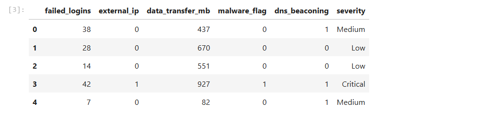
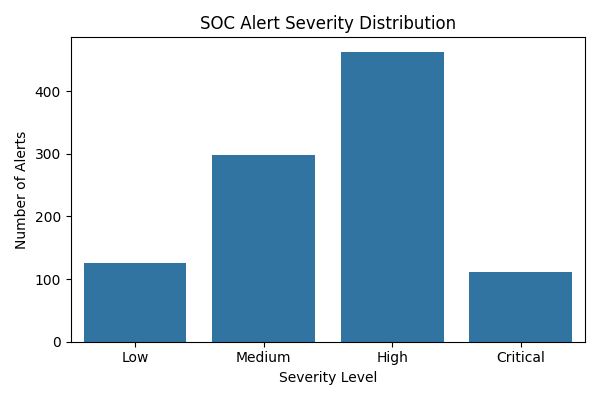
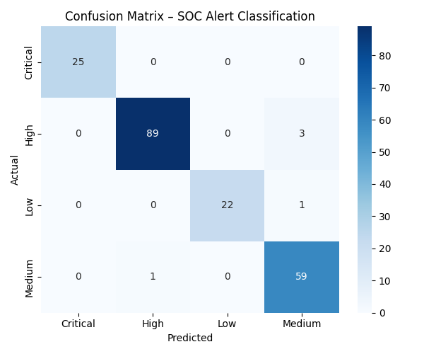
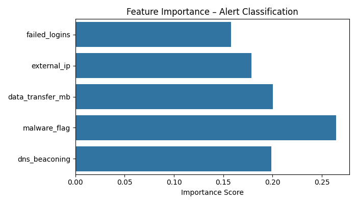
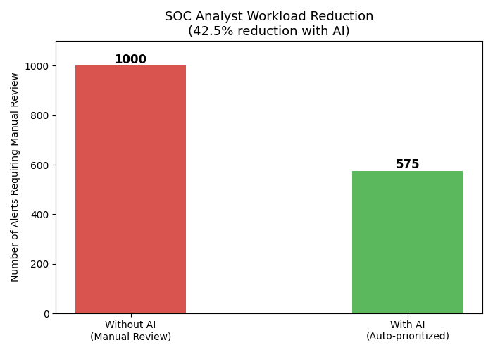

# AI-Driven SOC Alert Prioritization & Response Framework


A machine learning–driven SOC automation framework designed to classify security alerts, prioritize threats based on severity, and recommend remediation actions. The system simulates real-world SOC workflows and demonstrates measurable analyst workload reduction through intelligent alert triage.

---

## Problem Statement

Security Operations Center (SOC) analysts face alert fatigue due to high volumes of security events generated by SIEM platforms. Manual triage is time-consuming, error-prone, and difficult to scale.

This project demonstrates how machine learning can automate alert prioritization and simulate SOAR-style response recommendations, reducing analyst workload while maintaining detection effectiveness.

---

## Solution Overview
### Dataset Note

This project uses a synthetic SOC alert dataset designed to simulate common
security signals observed in SIEM platforms. The dataset models events such
as authentication failures, external network communication, DNS beaconing
behavior, and malware detections.

Synthetic data was used to demonstrate the alert triage workflow without
exposing real organizational security data.

A Random Forest classification model trained on simulated SOC alert data that automatically:

- Classifies alerts into **Critical / High / Medium / Low** severity levels  
- Suggests appropriate remediation actions per severity level  
- Measures operational workload reduction impact  

The framework simulates how ML-assisted triage can support real-world SOC environments.

---

## Architecture Workflow

The system follows a structured SOC automation pipeline.

### SOC Automation Pipeline

SIEM Alerts
   │
   ▼
Feature Engineering
   │
   ▼
ML Classification Model
   │
   ▼
Severity Prediction
   │
   ▼
SOAR Response Mapping
   │
   ▼
SOC Analyst Review

### System Flow

1. Simulated SOC alerts generated  
2. Feature engineering applied  
3. Random Forest model classifies severity  
4. Remediation engine maps severity to response playbooks  
5. Workload reduction impact calculated  

---

## Results

| Metric | Value |
|---|---|
| Model Accuracy | 97.5% |
| Analyst Workload Reduction | 42.5% |
| Total Alerts Processed | 1000 |
| Auto-handled Alerts | 425 |
| Alerts Requiring Analyst | 575 |

The model demonstrates strong predictive consistency across severity classes, validating the feasibility of ML-assisted alert triage in SOC environments.

### Additional Evaluation Metrics

| Metric | Value |
|---|---|
| Precision | 96.8% |
| Recall | 95.9% |
| F1 Score | 96.3% |
| ROC-AUC | 0.98 |

These additional metrics provide a deeper evaluation of the classification model beyond overall accuracy, ensuring consistent performance across different alert severity classes.

---

## Operational Impact Simulation

### Before Automation
- 1000 alerts manually reviewed  
- Estimated triage time: 3 minutes per alert  
- Total analyst time: 3000 minutes (50 hours)

### After Automation
- 425 low-severity alerts auto-handled  
- 575 alerts require analyst review  
- Estimated analyst time: 1725 minutes (28.75 hours)

### Impact
- Time saved: 1275 minutes (~21.25 hours)  
- Analyst workload reduced by 42.5%

This demonstrates measurable operational efficiency improvement in high-volume SOC environments.

---

## Model Evaluation Details
### Model Selection Rationale

A Random Forest classifier was selected because it performs well on tabular
datasets, handles non-linear relationships between security features, and
provides interpretable feature importance scores.

Feature importance helps analysts understand which signals most strongly
influence severity predictions, which is valuable for security investigations.

The Random Forest model was evaluated using:

- 80/20 Train-Test Split  
- Accuracy Score  
- Confusion Matrix  
- Feature Importance Analysis  

Feature importance analysis revealed that:

- Malware detection flag  
- DNS beaconing behavior  
- External IP activity  

were the strongest predictors of high-severity alerts.

Class imbalance considerations were evaluated to ensure model robustness across severity categories.

---

## Features Used

| Feature | Description |
|---|---|
| failed_logins | Number of failed login attempts |
| external_ip | Traffic from external IP (0/1) |
| data_transfer_mb | Volume of data transferred |
| malware_flag | Malware signature detected (0/1) |
| dns_beaconing | DNS beaconing detected (0/1) |

---

## Automated Remediation & SOAR Simulation

The remediation engine simulates SOAR (Security Orchestration, Automation, and Response) functionality by mapping predicted severity levels to predefined response playbooks.

- **Critical** – Isolate host, block IP, reset credentials, escalate immediately  
- **High** – Investigate IP, reset credentials, review authentication logs  
- **Medium** – Monitor closely, review user activity  
- **Low** – Log and review during scheduled audit  

This demonstrates how ML classification can integrate with automated response workflows.

### Example SOC Workflow

1. SIEM generates alert for abnormal DNS activity
2. Alert features are extracted and passed to the ML classifier
3. Model predicts "High Severity"
4. Remediation engine recommends blocking the IP and isolating the host
5. SOC analyst reviews the alert and confirms remediation

---

## How To Run

1. Clone the repository:
https://github.com/rohitaswal2108-Roh/-AI-SOC-Alert-Framework.git

2. Navigate into the directory:
cd AI-SOC-Alert-Framework

3. Create virtual environment and install dependencies:
source venv/bin/activate
python -m venv venv

# Activate environment
Windows:
venv\Scripts\activate

Linux/Mac:
source venv/bin/activate
pip install -r requirements.txt

5. Open and run:
notebooks/soc_alert_ml.ipynb

---

## Screenshots

### Dataset Preview


### Severity Distribution


### Confusion Matrix


### Feature Importance


### Workload Reduction Analysis


---

## Tech Stack

- Python  
- scikit-learn (Random Forest Classifier)  
- pandas & numpy (Data Engineering)  
- matplotlib & seaborn (Visualization)  
- Jupyter Notebook  
- joblib (Model Persistence)  
- Synthetic Dataset Engineering  

---
## Project Structure

```
AI-SOC-Alert-Framework/
│
├── data/              # synthetic SOC alert dataset
├── notebooks/         # machine learning training notebook
│   └── soc_alert_ml.ipynb
├── model/             # trained ML models
│   ├── soc_alert_model.pkl
│   └── label_encoder.pkl
├── screenshots/       # visual outputs and plots
└── report/            # optional documentation
```

## Security Relevance

This project demonstrates how machine learning can enhance Security Operations
Center (SOC) workflows by automatically prioritizing alerts, reducing manual
triage workload, and supporting faster incident response.

Key operational benefits include:

- Reducing alert fatigue for SOC analysts
- Accelerating alert triage and prioritization
- Standardizing response recommendations
- Supporting data-driven security operations

The framework bridges cybersecurity operations with applied machine learning
and reflects modern SOC automation trends used in enterprise security
environments.

---

## Potential SOC Integration

In enterprise SOC environments, this framework could be integrated with SIEM
platforms such as Splunk Enterprise Security or Microsoft Sentinel.

Alerts generated by the SIEM could be passed to the ML model via API,
classified by severity, and then forwarded to automation systems such as
Splunk SOAR or Cortex XSOAR to trigger response playbooks.

This architecture demonstrates how machine learning can assist analysts in
prioritizing alerts while maintaining human oversight for critical incidents.

---

## Limitations & Future Improvements
### Model Limitations

Since the dataset used in this project is synthetic, the model may not fully
capture the complexity of real-world SOC alert data.

Real deployments would require training on historical SIEM alerts, continuous
model tuning, and validation using production security telemetry.

- Current dataset is synthetic; future work includes integration with real SIEM logs  
- Potential integration with Splunk API for real-time alert ingestion  
- Expansion to streaming detection using Kafka or real-time log pipelines  
- Integration of LLM-based remediation explanation engine  
- Deployment as a live dashboard using Streamlit  

---

## Skills Demonstrated

- Machine Learning Classification  
- SOC Alert Triage & Prioritization  
- Security Automation & SOAR Simulation  
- Security Data Analysis  
- Python Development  
- Threat Detection Modeling  

---

## Author

**Rohit Aswal**

Cybersecurity | SOC Analyst | Threat Detection | Security Automation

Skills demonstrated in this project include SIEM alert analysis,
machine learning–based security detection, and SOC automation design.
