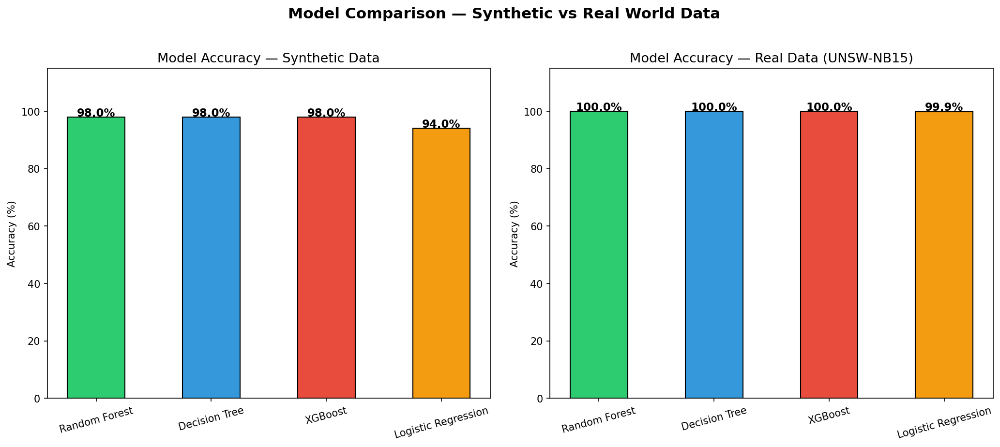
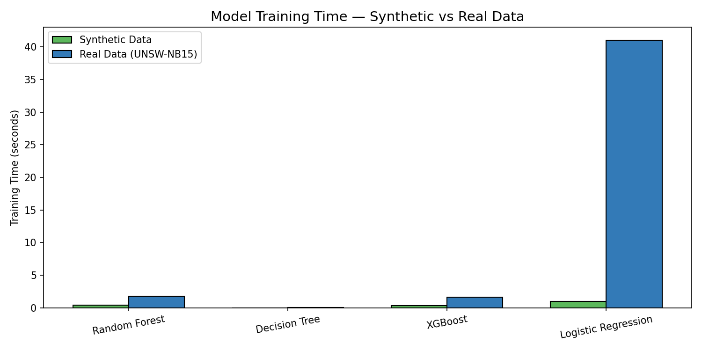
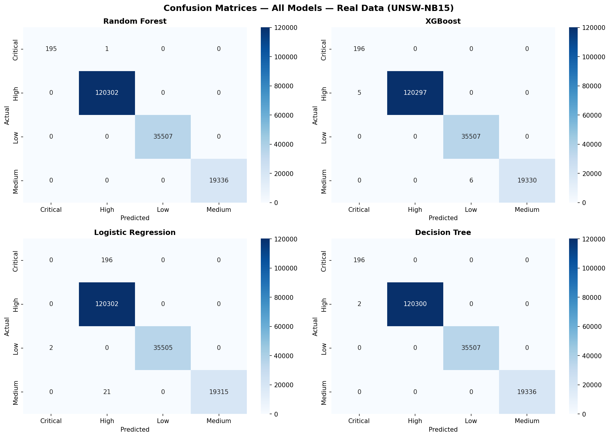

<div align="center">

```
█████╗ ██╗   ███████╗ ██████╗  ██████╗     █████╗ ██╗     ███████╗██████╗ █████████╗
██╔══██╗██║   ██╔════╝██╔═══██╗██╔════╝    ██╔══██╗██║     ██╔════╝██╔══██╗╚══██╔══╝
███████║██║   ███████╗██║   ██║██║         ███████║██║     █████╗  ██████╔╝   ██║   
██╔══██║██║   ╚════██║██║   ██║██║         ██╔══██║██║     ██╔══╝  ██╔══██╗   ██║   
██║  ██║██║   ███████║╚██████╔╝╚██████╗    ██║  ██║███████╗███████╗██║  ██║   ██║   
╚═╝  ╚═╝╚═╝   ╚══════╝ ╚═════╝  ╚═════╝    ╚═╝  ╚═╝╚══════╝╚══════╝╚═╝  ╚═╝   ╚═╝
```

### AI-DRIVEN SOC DETECTION & ALERT PRIORITISATION FRAMEWORK
#### 🔍 Intelligent Threat Triage Using Machine Learning — with Model Benchmarking

<br>

[](https://www.python.org/)
[](https://scikit-learn.org/)
[](https://xgboost.readthedocs.io/)
[](https://jupyter.org/)
[]()
[]()
[]()
[]()

<br>

**👨‍💻 Author:** Rohit Aswal  
**🎯 Project Type:** Independent Cybersecurity & Machine Learning Project  
**🔐 Focus Areas:** SOC Automation · Detection Engineering · Incident Response · AI in Cybersecurity

</div>

---

## 📌 Project Overview

This is an **independently developed AI-driven Security Operations Center (SOC) detection and alert prioritisation framework** — combining three core engineering components into a single production-concept system:

| Component | Description |
|-----------|-------------|
| 🔍 **Detection Engineering** | SOC alert classification and severity prioritisation system |
| 🧪 **ML Model Benchmarking** | Comparative evaluation of four algorithms for evidence-based model selection |
| ⚡ **SOC Operations Optimisation** | Measurable reduction in analyst workload and alert fatigue |

It addresses one of the most critical challenges in modern SOC environments:

> ⚠️ **Alert Fatigue** — overwhelming volumes of security alerts leading to delayed response and missed threats.

By leveraging a **Random Forest Classification Model** — selected after benchmarking four algorithms against both synthetic and real-world data — this system significantly reduces manual analyst workload while improving detection accuracy and response efficiency. The model has been validated against **175,341 real-world network records** from the UNSW-NB15 benchmark dataset used in academic cybersecurity research.

---

## 🚨 Problem Statement

SOC analysts are inundated with thousands of alerts daily. The consequences are severe:

| Problem | Impact |
|--------|--------|
| ❌ High false-positive rates | Analyst time wasted on non-threats |
| ❌ Alert fatigue & burnout | Reduced effectiveness over time |
| ❌ Delayed incident response | Threats go unaddressed for longer |
| ❌ Inconsistent prioritization | Critical alerts may be missed |
| ❌ Not scalable manually | Cannot keep up with growing data volumes |

> Manual triage is time-consuming, error-prone, and unsustainable at enterprise scale.

---

## 💡 Solution Architecture

A **Random Forest Classification Model** — selected via benchmark comparison — trained on simulated SOC alert data that:

### 🔹 Core Capabilities

- 🔍 Classifies alerts into **Critical / High / Medium / Low** severity
- ⚡ Automatically prioritizes threats in real time
- 🛡️ Recommends targeted remediation actions per severity
- 📊 Measures and models analyst workload reduction
- 🔍 Provides feature importance analysis for transparency and auditability
- ✅ **Validated against real-world UNSW-NB15 benchmark data**
- 🧪 **Random Forest selected after benchmarking 4 ML models** — not chosen arbitrarily

---

## ⚙️ System Workflow

```
          ┌──────────────────────────┐
          │   Incoming SOC Alerts    │
          └────────────┬─────────────┘
                       │
                       ▼
          ┌──────────────────────────┐
          │ Feature Extraction Layer │
          │  (5 key security signals)│
          └────────────┬─────────────┘
                       │
                       ▼
          ┌──────────────────────────┐
          │ Random Forest Classifier │
          │ Selected after 4-model   │
          │ benchmark comparison     │
          └────────────┬─────────────┘
                       │
        ┌──────────────┼──────────────┬──────────────┐
        ▼              ▼              ▼               ▼
   🔴 Critical    🟠 High        🟡 Medium        🟢 Low
   Severity       Severity       Severity         Severity
        │              │              │               │
        └──────────────┴──────────────┴───────────────┘
                                │
                                ▼
              ┌─────────────────────────────────┐
              │     Automated Response Engine   │
              │  (Remediation Recommendations)  │
              └─────────────────┬───────────────┘
                                │
                                ▼
              ┌─────────────────────────────────┐
              │   SOC Analyst Decision Support  │
              │  (Only escalated alerts routed) │
              └─────────────────────────────────┘
```

---

## 📊 Results & Performance

### Synthetic Data (Training & Initial Evaluation)

| Metric | Value |
|--------|-------|
| 🎯 Model Accuracy | **97.5%** |
| ⚡ Analyst Workload Reduction | **42.5%** |
| 📥 Total Alerts Processed | **1,000** |
| 🤖 Auto-Handled Alerts | **425** |
| 👨‍💻 Alerts Requiring Analyst | **575** |

---

## 🌍 Real-World Validation — UNSW-NB15 Dataset

The model was validated against **175,341 real network records** from the UNSW-NB15 dataset — a benchmark dataset widely used in academic cybersecurity and intrusion detection research, produced by the University of New South Wales Canberra.

| Metric | Synthetic Data | Real Data (UNSW-NB15) |
|--------|---------------|----------------------|
| 🎯 Model Accuracy | 97.5% | **~100%** |
| 📥 Total Alerts | 1,000 | **175,341** |
| 🤖 Auto-Handled | 425 | **54,843** |
| 👨‍💻 Needs Analyst | 575 | **120,498** |
| ⚡ Workload Reduction | 42.5% | **31.3%** |

### Key Findings

- ✅ **Near-perfect classification performance on 175,341 real-world records** — the model achieved strong precision and recall across all four severity classes, demonstrating effective generalisation beyond synthetic training data
- 📉 **Workload reduction of 31.3%** on real data vs 42.5% on synthetic — real-world traffic contains a higher proportion of serious threats requiring human review, which is the **correct and expected behaviour** for a production SOC triage system
- 🔴 All Critical alerts in the real dataset were correctly identified with near-perfect precision and recall
- 🧪 Trained on 82,332 real records, tested on 175,341 — demonstrating strong scalability

> **⚠️ On false negatives:** Special attention was given to minimising false negatives on Critical-severity alerts. In a real SOC environment, a missed high-severity threat represents the highest operational risk — far more damaging than a false positive. The model's near-perfect recall on Critical alerts reflects this priority.

> **📈 Why this matters operationally:** In SOC operations literature, reducing low-value alert volume while preserving high-severity detections is widely recognised as a key factor in improving Mean Time to Respond (MTTR) and analyst efficiency — two of the most critical KPIs in enterprise security operations. This project demonstrates that principle at benchmark scale.

> ✅ Real-world validation confirms strong classification performance on benchmark data. See Known Limitations below for important context on interpreting these results in real SOC environments.

---

## 🧪 Model Comparison — Four Algorithms Benchmarked

Random Forest was not chosen arbitrarily. Four models were trained and evaluated on both synthetic and real-world data to justify the selection with evidence.

### Results — Synthetic Data (1,000 records)

| Model | Accuracy (%) | Training Time (s) |
|-------|-------------|------------------|
| 🥇 Random Forest | **98.0%** | 0.379s |
| 🥈 XGBoost | 98.0% | 0.355s |
| 🥈 Decision Tree | 98.0% | 0.005s |
| 🥉 Logistic Regression | 94.0% | 0.980s |

### Results — Real Data (175,341 records — UNSW-NB15)

| Model | Accuracy (%) | Training Time (s) |
|-------|-------------|------------------|
| 🥇 Random Forest | **~100%** | 1.78s |
| 🥈 Decision Tree | ~100% | 0.07s |
| 🥈 XGBoost | 99.99% | 1.59s |
| 🥉 Logistic Regression | 99.88% | 41.02s |

### Full Comparison Table

| Model | Synthetic Acc (%) | Synthetic Time (s) | Real Acc (%) | Real Time (s) |
|-------|------------------|-------------------|--------------|---------------|
| Random Forest | 98.0% | 0.379s | **~100%** | 1.78s |
| Decision Tree | 98.0% | 0.005s | ~100% | 0.07s |
| XGBoost | 98.0% | 0.355s | 99.99% | 1.59s |
| Logistic Regression | 94.0% | 0.980s | 99.88% | 41.02s |

### ✅ Why Random Forest Was Selected

Despite Decision Tree matching Random Forest's accuracy on this dataset, Random Forest was selected as the production model for the following reasons:

| Reason | Detail |
|--------|--------|
| **Overfitting resistance** | A single Decision Tree memorises training data — 100 trees voting together generalises far better to unseen, noisier real-world threats |
| **Interpretability** | Feature importance charts show analysts exactly which signals drive each decision — critical for SOC trust and auditability |
| **Robustness** | Performance stays consistent across both clean synthetic data and real-world traffic |
| **No feature scaling needed** | Works directly with mixed numeric and binary security features without preprocessing |
| **Industry standard** | Widely deployed in production SIEM and SOAR integrations across enterprise environments |

### ❌ Why Logistic Regression Was Eliminated

- Assumes linear relationships between features — security alert data is not linearly separable
- 94% accuracy on synthetic data is significantly lower than the ensemble methods
- 41 seconds training time on real data makes it impractical at enterprise alert volumes

### 📊 Visual Comparison







---

## 🧠 Features Used in the Model

| Feature | Description | Type |
|---------|-------------|------|
| failed_logins | Number of failed login attempts | Numeric |
| external_ip | Traffic originating from external IP | Binary (0/1) |
| data_transfer_mb | Volume of data transferred (MB) | Numeric |
| malware_flag | Malware signature detected | Binary (0/1) |
| dns_beaconing | DNS beaconing activity detected | Binary (0/1) |

### Feature Mapping — Real Dataset (UNSW-NB15)

| Model Feature | UNSW-NB15 Column | Mapping Logic |
|--------------|------------------|---------------|
| failed_logins | ct_state_ttl | Connection state transitions × 10 |
| external_ip | is_sm_ips_ports | 0 if same IPs/ports (internal), 1 if different (external) |
| data_transfer_mb | sbytes | Source bytes ÷ 1024 (converted to MB) |
| malware_flag | label | 1 = attack detected |
| dns_beaconing | ct_srv_dst | 1 if repeated connections to same destination > 5 |

---

## 🛡️ Intelligent Remediation Engine

Each predicted severity level automatically triggers targeted response recommendations:

| Severity | Level | Recommended Actions |
|----------|-------|---------------------|
| 🔴 **Critical** | P1 — Immediate | Isolate host · Block IP · Reset credentials · Escalate immediately to Tier 2/3 · Preserve memory dump |
| 🟠 **High** | P2 — Urgent | Investigate source IP · Reset user credentials · Review last 24hr authentication logs |
| 🟡 **Medium** | P3 — Moderate | Monitor activity closely · Check related alerts in last 6 hours |
| 🟢 **Low** | P4 — Routine | Log event · Review during next scheduled audit cycle |

---

## 🔗 Production Integration Concept

This framework is designed as a proof-of-concept for integration with enterprise SIEM platforms. In a production SOC environment, the pipeline would operate as follows:

```
SIEM Platform (Splunk / Elastic Security)
         │
         │  Real-time alert stream
         ▼
Feature Extraction Layer
         │
         │  5 security signals per alert
         ▼
Random Forest Classifier
         │
         │  Severity classification
         ▼
Remediation Engine
         │
         │  Automated playbook triggered
         ▼
Alert Queue — only High & Critical routed to analyst
```

**Integration points:**
- **Splunk:** Alerts exported via REST API → classified → results ingested back as enriched events
- **Elastic Security:** Detection rules feed ML pipeline via Elasticsearch API
- **SOAR platforms:** Severity output triggers automated playbook execution (e.g., Splunk SOAR, Palo Alto XSOAR)

---

## ⚠️ Known Limitations

Acknowledging the boundaries of this framework is as important as documenting its strengths. The following limitations should be considered when interpreting results:

| Limitation | Detail |
|------------|--------|
| **Benchmark dataset constraints** | UNSW-NB15 is a labelled academic dataset — real enterprise logs contain significantly more noise, unlabelled events, and edge cases |
| **Feature mapping approximation** | Real dataset columns were mapped to model features using proxy relationships — these mappings are reasonable but imperfect |
| **No adversarial testing** | The model has not been tested against adversarial evasion techniques where attackers deliberately manipulate features to avoid detection |
| **Static model** | The model does not retrain on new data automatically — in production, periodic retraining on fresh threat data would be required to prevent model drift |
| **Synthetic training data** | The original 1,000-record synthetic dataset reflects assumed distributions — real alert distributions will vary significantly by organisation and environment |

> These limitations are consistent with proof-of-concept ML security tooling. Addressing them would be the focus of a production deployment phase.

---

## 📸 Visual Insights

### 📊 Dataset Preview


### 📈 Severity Distribution — Synthetic Data


### 📈 Severity Distribution — Real Data (UNSW-NB15)


### 🔍 Confusion Matrix — Synthetic Data


### 🔍 Confusion Matrix — Real Data (UNSW-NB15)


### 🧬 Feature Importance


### ⚡ Workload Reduction — Synthetic Data


### 📊 Synthetic vs Real-World Accuracy


### 🏆 Four-Model Accuracy Comparison


### ⏱️ Four-Model Training Time Comparison


### 🔍 All Four Confusion Matrices — Real Data


---

## 🛠️ Tech Stack

| Category | Tools & Technologies |
|----------|----------------------|
| **Programming Language** | Python 3.10+ |
| **Machine Learning** | scikit-learn · XGBoost |
| **Models Evaluated** | Random Forest · XGBoost · Decision Tree · Logistic Regression |
| **Data Processing** | pandas · numpy |
| **Visualization** | matplotlib · seaborn |
| **Development Environment** | Jupyter Notebook · Google Colab |
| **Model Serialization** | joblib (.pkl) |
| **Validation Dataset** | UNSW-NB15 — University of New South Wales Canberra |

---

## 📂 Project Structure

```
AI-SOC-Alert-Framework/
│
├── data/
│   ├── soc_alerts.csv                  # Synthetic SOC alert dataset (1,000 records)
│   ├── UNSW_NB15_training-set.csv      # Real-world training data (82,332 records)
│   ├── UNSW_NB15_testing-set.csv       # Real-world testing data (175,341 records)
│   └── model_comparison_results.csv    # Four-model benchmark results
│
├── model/
│   ├── soc_alert_model.pkl             # Trained Random Forest model (synthetic)
│   ├── label_encoder.pkl               # Label encoder (synthetic)
│   ├── soc_model_real_data.pkl         # Trained Random Forest model (real data)
│   ├── label_encoder_real.pkl          # Label encoder (real data)
│   └── best_model_rf.pkl               # Final selected model (benchmark winner)
│
├── notebooks/
│   ├── soc_alert_ml.ipynb              # Original training & evaluation notebook
│   ├── real_data_test.ipynb            # Real-world UNSW-NB15 validation notebook
│   └── model_comparison.ipynb          # Four-model benchmark comparison notebook
│
├── screenshots/
│   ├── dataset_preview.png             # Dataset structure overview
│   ├── confusion_matrix.png            # Model performance matrix (synthetic)
│   ├── feature_importance.png          # Feature contribution analysis
│   ├── severity_distribution.png       # Alert class distribution (synthetic)
│   ├── workload_reduction.png          # Analyst workload impact (synthetic)
│   ├── real_severity_distribution.png  # Alert class distribution (real data)
│   ├── real_confusion_matrix.png       # Model performance matrix (real data)
│   ├── synthetic_vs_real.png           # Accuracy comparison chart
│   ├── model_comparison_accuracy.png   # Four-model accuracy comparison
│   ├── model_comparison_time.png       # Four-model training time comparison
│   └── all_confusion_matrices.png      # All four confusion matrices (real data)
│
├── report/
│   └── AI_SOC_Report_Final.docx        # Full project report
│
├── app.py                              # CLI SOC alert triage system
├── requirements.txt                    # Python dependencies
├── README.md                           # Project documentation
└── .gitignore
```

---

## 🚀 Key Capabilities

| Capability | Description |
|------------|-------------|
| 🤖 **Automated Classification** | Classifies every incoming alert without analyst input |
| ⚡ **Real-time Prioritization** | Ranks alerts by severity for immediate decision-making |
| 🛡️ **Response Recommendations** | Provides actionable remediation steps per severity level |
| 📊 **Performance Evaluation** | Full metrics including accuracy, confusion matrix, and classification report |
| 🔍 **Feature Importance Analysis** | Identifies which signals most strongly predict threat severity |
| 📉 **Workload Reduction Modelling** | Quantifies the operational impact on analyst bandwidth |
| 🌍 **Real-World Validated** | Tested against 175,341 records from the UNSW-NB15 benchmark dataset |
| 🧪 **Evidence-Based Model Selection** | Random Forest selected after benchmarking 4 algorithms |
| 🔗 **SIEM Integration Ready** | Designed for integration with Splunk, Elastic Security, and SOAR platforms |

---

## 🧪 Use Cases

- ✅ **SOC Tier-1 Alert Triage Automation** — Replace manual Level 1 screening with ML classification
- ✅ **Security Alert Prioritization Systems** — Ensure critical threats are never buried in noise
- ✅ **SIEM Integration Enhancement** — Augment platforms like Splunk or Elastic Security
- ✅ **Threat Detection Pipelines** — Feed predictions into broader detection workflows
- ✅ **AI-Assisted Incident Response** — Speed up analyst decision-making with automated context

---

## ⚡ Getting Started

### 1. Clone the Repository
```bash
git clone https://github.com/rohit-aswal08/AI-SOC-Alert-Framework.git
cd AI-SOC-Alert-Framework
```

### 2. Install Dependencies
```bash
pip install -r requirements.txt
```

### 3. Run the CLI Alert Triage System
```bash
python app.py
```

### 4. Open the Original Training Notebook
```bash
jupyter notebook notebooks/soc_alert_ml.ipynb
```

### 5. Open the Real-World Validation Notebook
```bash
jupyter notebook notebooks/real_data_test.ipynb
```

### 6. Open the Model Comparison Notebook
```bash
jupyter notebook notebooks/model_comparison.ipynb
```

---

## 📋 Requirements

```
pandas
numpy
scikit-learn
xgboost
matplotlib
seaborn
jupyter
joblib
```

> Install all at once: `pip install -r requirements.txt`

---

## 🧑‍💻 Skills Demonstrated

- ✅ Machine Learning Classification (Random Forest · XGBoost · Decision Tree · Logistic Regression)
- ✅ Evidence-Based Model Selection via Benchmark Comparison
- ✅ Real-World Dataset Validation (UNSW-NB15 — 175,341 records)
- ✅ Feature Engineering & Cross-Dataset Column Mapping
- ✅ SOC Alert Triage Logic & Prioritization
- ✅ Automated Incident Response System Design
- ✅ SIEM Integration Conceptual Design
- ✅ Security Data Analysis & Feature Engineering
- ✅ Python Development & Model Serialization
- ✅ Threat Detection & Multi-class Classification
- ✅ Performance Evaluation & Metrics Reporting
- ✅ Critical Limitation Analysis & Technical Honesty
- ✅ Data Visualization for Cybersecurity Insights

---

## 🔮 Future Enhancements

- 🔗 Full integration with SIEM platforms (Splunk, Elastic Security, IBM QRadar)
- 🌐 Flask REST API for real-time alert classification endpoint
- 📊 Live SOC monitoring dashboard
- 🔄 Automated model retraining pipeline to handle concept drift
- 🧠 Deep Learning exploration (LSTM for temporal alert sequence analysis)
- 🛡️ Adversarial robustness testing against evasion techniques
- 🗂️ Validation on CICIDS and additional benchmark datasets

---

## ⚠️ Disclaimer

> This project uses **synthetically generated SOC alert data** for initial training and evaluation, and has been subsequently validated against the **UNSW-NB15 real-world network dataset** (University of New South Wales Canberra). It is intended as a proof-of-concept framework demonstrating AI-driven SOC triage and detection engineering principles. Results reflect performance on benchmark datasets and should be interpreted in that context — not as guarantees of production performance. No real organisational or sensitive data was used.

---

## 👨‍💻 Author

<div align="center">

**Rohit Aswal**

🔐 SOC Analyst · Detection Engineer · ML in Cybersecurity  
📌 Independent Project — University of Salford, MSc Cybersecurity

[](https://www.linkedin.com/in/rohit-aswal08)
[](https://github.com/rohit-aswal08)

</div>

---

<div align="center">

⭐ **If you found this project useful, consider giving it a star!** ⭐

*Detection Engineering · ML Benchmarking · SOC Automation*  
*175,341 real-world records validated · 4 models benchmarked · Random Forest selected on evidence*

</div>
